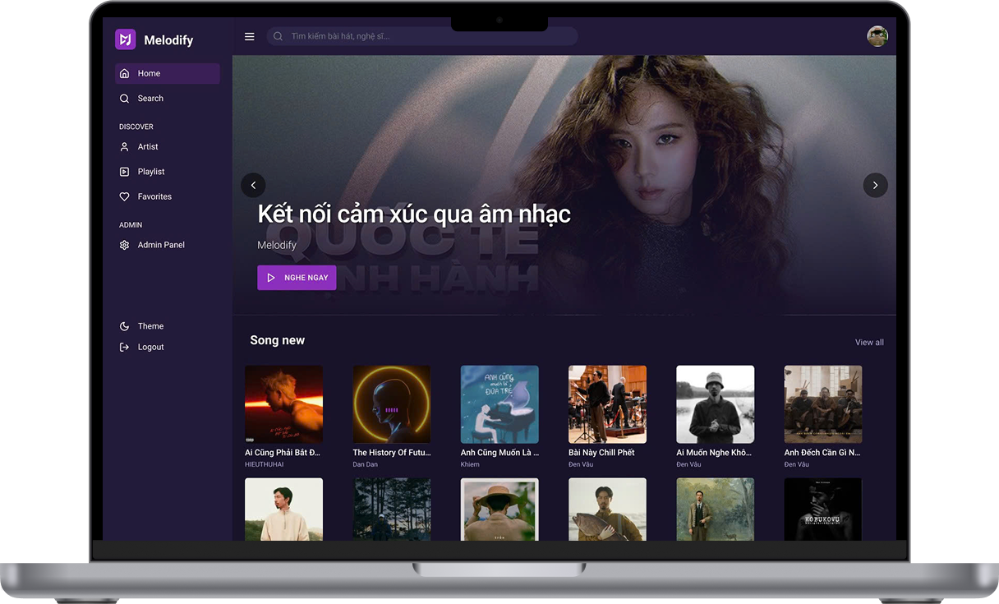

# Dự án Melodify

Melodify là một nền tảng nghe nhạc nơi người dùng có nghe những bài hát yêu thích và theo dõi nghệ sĩ của những bài hát, chia sẻ và tạo các playlist. Dự án được xây dựng dựa trên kiến trúc client server với client React và server .NET.

## Tổng quan hệ thống

## 

## Cấu trúc dự án

```
├── mockups/ # Các file thiết kế Figma

├── README.md # File mô tả dự án này

├── setup/ # Các file thiết lập, bao gồm các script SQL

├── src/ # Mã nguồn

  ├── melodify-client/ # Mã nguồn phía client

  ├── MelodifyAPI/
    
    ├── MelodifyAPI/ # Mã nguồn phía server

    ├── init-scripts/ # Các script hỗ trợ

    ├── Dockerfile # File Dockerfile của API

    ├── Dockerfile.sqlserver # File Dockerfile của SQL Server

    ├── docker-compose.yml # File docker-compose

├── thesis/  # Các tài liệu của dự án
├── docs/  # Các tài liệu về báo cáo và thuyết trình
```
## Mô tả chi tiết

### Phía client

Phía client được xây dựng dựa trên React.

### Phía server

Phía server được xây dựng dựa trên .NET. Các tệp quan trọng bao gồm:

-   AuthController.cs: Controller xử lý các yêu cầu liên quan đến xác thực.
-   SongController.cs:Controller xử lý các yêu cầu liên quan đến bài hát.
-   UserController.cs: Controller xử lý các yêu cầu liên quan đến người dùng.
- ....

### Docker

Dự án sử dụng Docker để đóng gói và triển khai. Cấu hình Docker có thể được tìm thấy trong file Dockerfile.

## Cách chạy dự án

Để chạy dự án, bạn cần cài đặt Docker và Docker Compose. Sau đó, chạy lệnh sau:
```
cd src/MelodifyAPI
docker-compose  up --build
```
Dự án sẽ được chạy tại   
>`http://localhost:7153`.